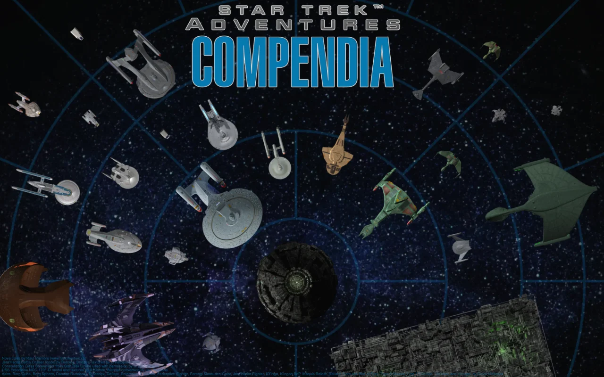
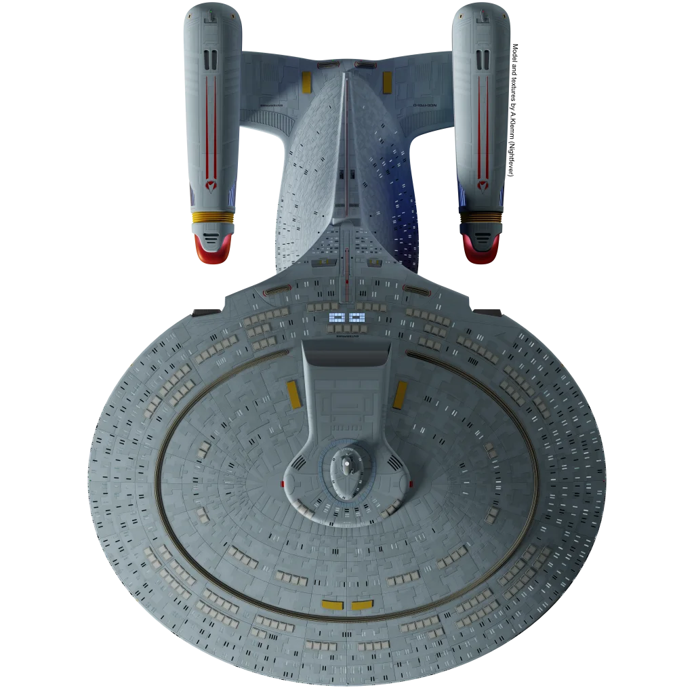

# Star Trek Adventures Compendia for Foundry VTT (Unofficial)

This is the repository for the "Star Trek Adventures Compendia" module for "Foundry VTT". It contains ready-made assets for playing the roleplaying game "Star Trek Adventures" via the virtual tabletop software "Foundry VTT". This unofficial module uses content from the original (Starfleet) "Star Trek Adventures Core Rulebook" with permission from Modiphius Entertainment under certain restrictions (see below). 

## Features
{ width: 150px }
The Unofficial Star Trek Adventures Compendia makes setting up a game of "Star Trek Adventures" in "Foundry VTT" easy and effortless by providing compendia for many often used aspects of the game. Currently available compendia are:
- Character roles (modelled as Talents)
- Character talents (species-specific, Command, Conn, Security, Engineering, Science, Medical, and general)
- Example character focusses
- Example character values
- Personal weapons and equipment (W.I.P.)
- Starship talents
- Starship damage & automated roll-table
- Character templates (W.I.P)
- Icons for damage, focuses, roles, starship weapons, talents and values (50+ motives with lots of variations)
- Icons for personal weapons and equipment (W.I.P.)
- Generic NPC and starship tokens (W.I.P)
- 3D-rendered starship tokens (W.I.P.)

## Requirements and Installation
{ width: 150px }
- Foundry VTT 10.x https://foundryvtt.com
- Star Trek Adventures (Unofficial) https://github.com/mkscho63/sta
- Optional, but recommended: LCARS UI for Star Trek Adventures (Unofficial) https://github.com/FabulistVtt/sta-lcars-ui

## Important Copyright Notice for Users and Contributors
{ width: 150px }
Due to the agreement with Modiphius Entertainment Ltd. to use their copyrighted material for this module, "Star Trek Adventures Compendia" can and will not provide content outside of the Starfleet "Core Rulebook" an/or content relating to NPCs and their stats. Gamemasters can easily create Talents, NPCs, and Alien Starships using the materials from "Star Trek Adventures Compendia" for personal use, but may not upload them (see below). My agreement with Modiphius Entertainment Ltd. for this module covers player-facing textual content from the original Starfleet "Core Rulebook" (English edition) only. **Please do not submit Issues or Pull requests asking for or containing any of the following**:
- content from chapters 9.7, 10, 11, or 12 of the Starfleet "Core Rulebook" (i.e. "Gamemaster's-eyes-only" content)
- content from any non-English edition of the Starfleet "Star Trek Adventures Core Rulebook"
- content from any other "Star Trek Adventures" publication than the Starfleet "Star Trek Adventures Core Rulebook"
- images from any "Star Trek Adventures" publication
- text, images, sounds, video or other media from other sources, unless under CC0-license (**you must provide verifiable license information with any Pull request containing assets**)

Please respect these guidelines for any Issues or Pull requests.

See [LICENSE.md](LICENSE.md) for further copyright and license information.